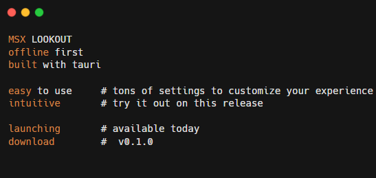
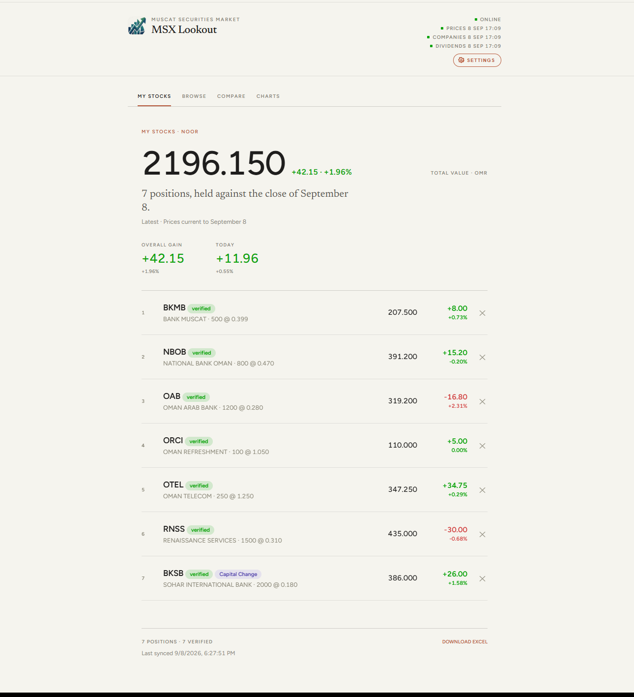

# MSX Lookout

Tracks stocks on the Muscat Stock Exchange. Built for one person. You check prices, keep what you hold, and get an email if a stock goes above or below a number you set.



## How it works


MSX trading days are Sunday to Thursday. After close, around 5pm, a job pulls that day's prices from MSX's own site and saves them. Nothing gets overwritten, so history just grows.

It also checks alerts you set, BKMB below 1.400, that kind of thing, and can send a digest with gainers, losers, volume, and an Excel of the day. Corporate announcements from MSX get filed against the right company.

There's about two years of history already in there, mid-2024 on, so "did I buy at a fair price?" works for older positions too.

The digest email needs a domain if you want it looking proper. That's about $10/year. If you don't bother, that part can stay off.

## The app

One file, `web/index.html`. No login. Open it and use it. Same file is what the Windows app wraps.



My stocks is your watchlist. Price, day change, gain or loss in actual money.

Browse is every listed company, not just yours. Search by name, ticker, or sector. Quiet names, nothing traded in a while, often under liquidation, are marked.

Click a stock to add a position. Quantity, buy price, date. It checks that price against history and says if it looks right, close, or off. It never blocks the save.

Alerts are end-of-day emails, not trade orders. A stock alert is not a broker order.

Charts are candles or area, volume, some drawing tools. Compare is two date ranges and what moved. Excel export is under Settings.

If MSX is down the app says so and shows the last confirmed price and when it was from. It does not invent a number.

Offline is basic. Last load stays on the device. Bad wifi shows old data with a last-synced note, not a blank screen. Writes (settings, watch, save) queue locally and go out when you're back online.

Settings is the gear. Theme, your name, how often prices and companies refresh, digest email, which emails you actually want.

```
1  all email notifications     # everything
2  new listings and delistings # a company joined or left MSX
3  update failure alerts       # the daily pull is dying, so it isn't silent
```

Leave the email field empty and nothing gets sent. Turning the master switch off also stops everything, including the failure mail.

## Where it lives

Prices, companies, watchlist, alerts sit in one Supabase project.

Daily ingest, digest, alerts, company refresh, and a weekly backup are Edge Functions on a schedule. No extra servers. How often prices vs companies vs digest run is a setting in the app. Daily, weekly, monthly, or never.

The page is static HTML. GitHub Pages can host it. The Windows app is Tauri, same page, updates from GitHub Releases when a release exists.

## Status

Works. Fork it if you want your own copy. Issues and PRs are fine. I'll update this file if something big breaks or gets fixed.

The Windows installer goes up when there's a release. Until then, `cargo tauri dev` is the window.
