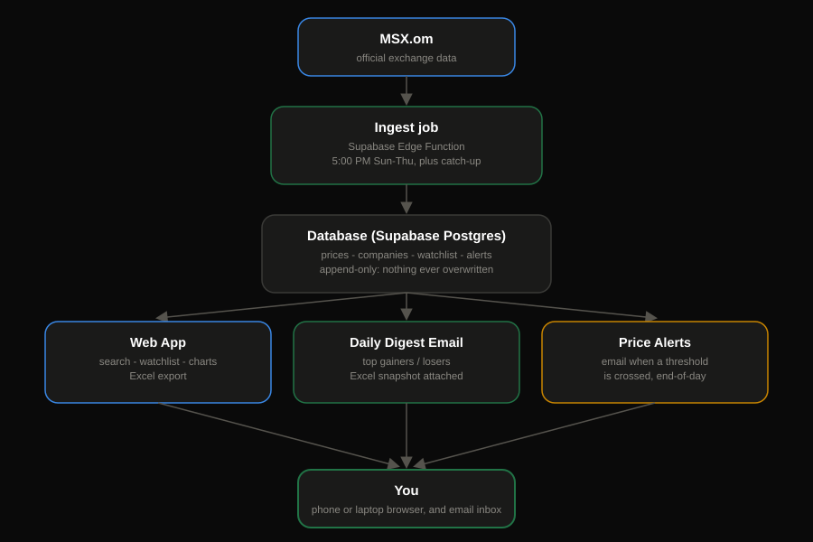
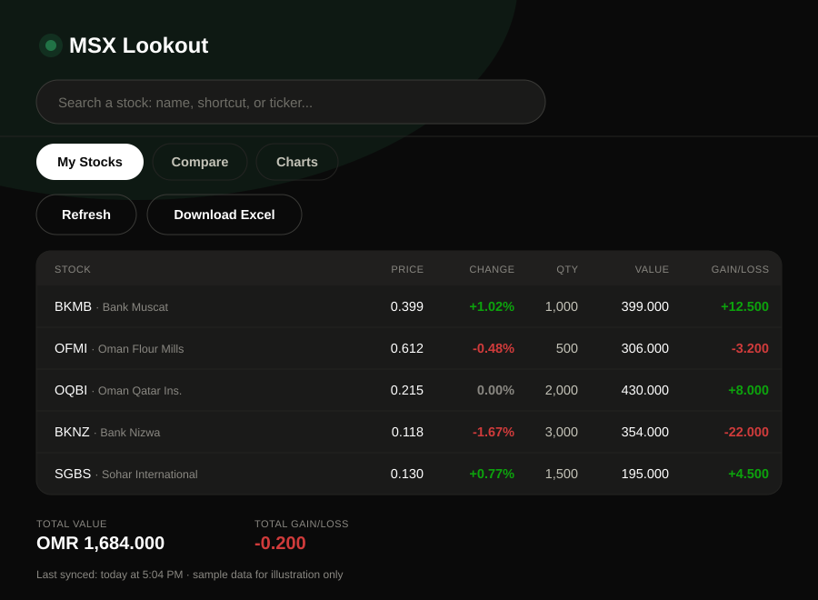

# MSX Stock Lookout

This is a private tool that tracks stocks on the Muscat Stock Exchange (MSX) —
built for one person to check prices, watch a personal portfolio, and know when
a stock hits a price they care about.

## What it actually does

Every trading day (Sunday–Thursday, right after MSX closes), the system:

1. Pulls that day's prices for every listed stock directly from MSX's own site.
2. Saves them permanently in a database — nothing ever gets overwritten, so the
   full price history keeps growing.
3. Checks any price alerts that were set (e.g. "tell me if BKMB drops below
   1.400") and emails a heads-up if one was crossed.
4. Sends a daily summary email — top gainers/losers, volume, an Excel snapshot
   attached — so the day's action is visible without opening anything.
5. Watches MSX's announcements feed for corporate actions (splits, dividends,
   new listings) and files them against the right company.

Two years of history (mid-2024 onward) was pulled in up front, so price lookups
and "did I buy at a fair price?" checks work even for older positions, not just
ones bought after this system started running.

## The app

One simple web page (`web/index.html`) is the front door — no login screen,
fully open on purpose (the tradeoff was made deliberately and knowingly, not
an oversight).

*(This is a to-scale mockup built from the app's real colors and layout, not a
live screenshot — swap it for an actual screenshot once you have the page
open in a browser, at the same file path, and this section updates itself.)*

It shows:

- **Watchlist** — what's held, today's price, day change, and gain/loss in
  actual money, color-coded green/red. Removing a stock updates instantly.
- **Browse** — every listed company, not just the watchlist, filterable by
  name/ticker/sector, with a plain flag for anything that's gone quiet or
  never traded (mostly stocks under liquidation).
- **Add a position** — click any stock (Browse, or the searchable picker) to
  enter what was bought, at what price, on what date. It checks that price
  against real history and tells you if it looks right, close, or off — but
  never blocks you from saving anyway.
- **Alerts** — an optional "notify me" toggle when adding a position, so a
  price threshold gets watched automatically. These are end-of-day notices
  only, not trade orders — a stock alert isn't a broker order.
- **Charts** — a proper interactive price chart (candles or area, volume,
  duration picker, and real drawing tools — trend lines, fibonacci, etc.) per
  stock, plus portfolio-level bar/pie views and a "how are my stocks doing vs
  each other" comparison view.
- **Compare** — pick two time periods (or "this week vs last") and see what
  moved.
- **Download Excel** — any view can be exported to a formatted spreadsheet;
  past exports are archived and browsable from Settings.
- **Settings** (the gear icon) — light/dark/system theme, a display name and
  greeting, how often prices and company data refresh, and the Excel archive.
- If MSX itself is down, the app says so plainly and shows the last confirmed
  price with a timestamp instead of pretending nothing's wrong.

The page also works offline in a basic way: whatever it last loaded is saved
on the device, so a bad connection shows old-but-real data with a "last
synced" note rather than a blank screen. A native Windows app that leans into
this further (installable, self-updating) now exists too — see "Current status."

## Where everything lives

- **Database:** Supabase (Postgres) — one project holds all the price
  history, the company list, the watchlist, and alerts.
- **The daily jobs** (ingest prices, send digest, send alerts, company/sector
  refresh, weekly backup) run as Supabase Edge Functions on a schedule — no
  separate server to babysit. How often prices vs. company data refresh is
  now a setting in the app itself (daily/weekly/monthly, your choice), not
  fixed in code.
- **The web page** is a single static HTML file, meant to be hosted for free
  on GitHub Pages, and has been extensively tested live against the real
  Supabase backend (not just opened locally).
- **Emails** go out through Resend.

## Current status

The backend has been running correctly and gained a lot of ground since
launch: full theming (light/dark/system), a real settings surface (display
name, digest email, Excel export archive, configurable update frequency),
and an interactive price chart with real drawing tools, all live against the
deployed Supabase project.

A Windows desktop version now exists — built with Tauri, self-updating, first
installer (`v0.1.0`) built and installed for a real first look. It works, but
came back with a punch list of rough edges (installer branding, some leftover
dev data, native window styling, a couple of frontend polish items) that are
being worked through before it's the everyday way this gets used.

Still open, on purpose, not urgent:
- Publishing the web page somewhere reachable (GitHub Pages) and handing over
  the bookmark link.
- The known annoyance that a price alert has to be set both here and in the
  actual broker app — acknowledged, not solved yet, revisit once there's real
  usage to learn from.
